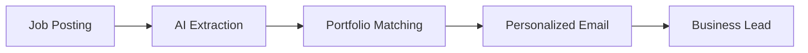

```markdown
# 🚀 Cold Email Generator with Llama2

<div align="center">
  
  
  
  
  
  
  <h3>🎯 Generate Personalized Cold Emails with AI</h3>
  <p>Leverage the power of Llama2 and LangChain to create compelling, context-aware business emails</p>
  
  [Demo](#-demo) • [Features](#-features) • [Installation](#-installation) • [Usage](#-usage) • [Credits](#-credits)
  
</div>

---

## 📺 Demo

<div align="center">
  
  <p><i>System Architecture Overview</i></p>
</div>

## 🎥 Video Tutorial

> 🙏 **Special Thanks**: This project was inspired by and developed following the excellent tutorial from [**Codebasics**](https://www.youtube.com/@codebasics). Check out their amazing content on data science, AI, and machine learning!

<div align="center">
  <a href="https://www.youtube.com/@codebasics">
    
  </a>
</div>

## ✨ Features

<table>
<tr>
<td>

### 🤖 AI-Powered Generation
Generate personalized emails using Llama2 via Groq API

</td>
<td>

### 🔍 Smart Context Matching
ChromaDB vector store for intelligent portfolio matching

</td>
</tr>
<tr>
<td>

### 🌐 Web Scraping
Extract job descriptions directly from URLs

</td>
<td>

### 🔗 LangChain Integration
Seamless orchestration of LLMs and data sources

</td>
</tr>
</table>

## 🛠️ Tech Stack

<div align="center">
  
| Technology | Purpose |
|------------|---------|
|  | Core Programming Language |
|  | Language Model |
|  | LLM Framework |
|  | Vector Database |
|  | Web Interface |
|  | Data Processing |

</div>

## 📦 Installation

### Prerequisites
- Python 3.8+
- Groq API Key ([Get it here](https://console.groq.com))

### 🚀 Quick Start

```bash
# 1. Clone the repository
git clone https://github.com/yourusername/email-generation-llama2.git
cd email-generation-llama2

# 2. Create virtual environment
python -m venv venv
source venv/bin/activate  # On Windows: venv\Scripts\activate

# 3. Install dependencies
pip install -r requirements.txt

# 4. Set up environment variables
echo "GROQ_API_KEY=your_api_key_here" > .env
```

## 💻 Usage

### 🎨 Run the Streamlit App

```bash
cd app
streamlit run main.py
```

### 📓 Explore Jupyter Notebooks

```bash
jupyter notebook email_generator.ipynb
```

### 🔧 API Usage

```python
from chains import Chain
from portfolio import Portfolio

# Initialize components
chain = Chain()
portfolio = Portfolio()

# Load portfolio data
portfolio.load_portfolio()

# Generate email
job_description = "Your job description here..."
jobs = chain.extract_jobs(job_description)
email = chain.write_mail(jobs[0], portfolio.query_links(jobs[0]['skills']))
print(email)
```

## 📁 Project Structure

```
📦 email-generation-llama2/
┣ 📂 app/
┃ ┣ 📜 chains.py          # LangChain integration
┃ ┣ 📜 main.py            # Streamlit app
┃ ┣ 📜 portfolio.py       # Portfolio management
┃ ┣ 📜 utils.py           # Utility functions
┃ ┣ 📂 imgs/              # Screenshots & diagrams
┃ ┣ 📂 resource/          # Portfolio data
┃ ┗ 📂 vectorstore/       # ChromaDB storage
┣ 📓 email_generator.ipynb # Main demo notebook
┣ 📓 tutorial_chromadb.ipynb # ChromaDB tutorial
┗ 📄 README.md
```

## 🎯 Real-World Use Case

### 🏢 Business Development Scenario

<div align="center">
  
</div>

#### 🔴 Problem
Nike needs a Principal Software Engineer. Traditional hiring involves:
- 📅 Long recruitment cycles
- 💰 High costs for onboarding
- ⏱️ Training time delays

#### 🟢 Solution
AtliQ provides dedicated engineers as a service. Our tool helps:



#### ✅ Benefits

- **🚀 Speed**: Generate emails in seconds
- **🎯 Precision**: Match skills automatically
- **📈 Scale**: Handle multiple outreach campaigns
- **💡 Personalization**: Context-aware messaging

## 🤝 Contributing

We welcome contributions! Please see our [Contributing Guidelines](CONTRIBUTING.md) for details.

```bash
# Fork the repo
# Create your feature branch
git checkout -b feature/AmazingFeature

# Commit your changes
git commit -m 'Add some AmazingFeature'

# Push to the branch
git push origin feature/AmazingFeature

# Open a Pull Request
```

## 📜 License

This project is licensed under the MIT License - see the [LICENSE](LICENSE) file for details.

## 🙏 Acknowledgments

<div align="center">
  
### 🌟 Special Thanks to [Codebasics](https://www.youtube.com/@codebasics)
  
This project was built following the excellent tutorials from **Codebasics YouTube Channel**.
Their comprehensive guides on AI, data science, and machine learning were instrumental in developing this application.

<a href="https://www.youtube.com/@codebasics">
  
</a>

</div>

---

<div align="center">
  
### 📬 Connect & Support

[](https://github.com/yourusername)
[](https://linkedin.com/in/yourusername)
[](https://twitter.com/yourusername)

⭐ Star this repo if you find it helpful!

</div>
```
